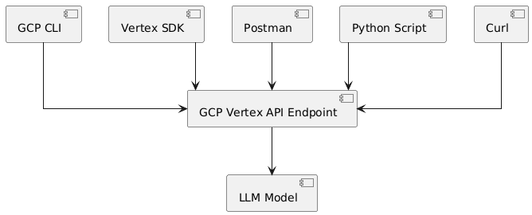

# genai

GenerativeAI Course

Setup involved below activities

1. GCP account setup
2. GCP CLI setup
3. Enable VERTEX APIs
4. Create VM with ML model on cloud
5. Query VM from GCP CLI
6. Query from SDK
7. Query from Python Script
8. Query from Postman
9. Query from CURL
10. Selection of different ML model
11. Working with AI Studio

* Curl Hello world
  `curl \ -H 'Content-Type: application/json' \ -d '{"contents":[{"parts":[{"text":"Explain how AI works"}]}]}' \ -X POST 'https://generativelanguage.googleapis.com/v1beta/models/gemini-1.5-flash-latest:generateContent?key=YOUR_API_KEY'`
* 

## Other pointers

magika gitpython
